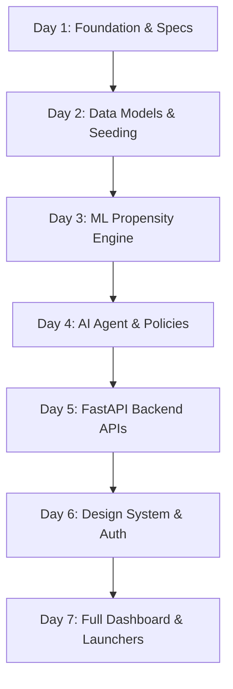

# 📅 7-Day GitHub Upload & Commit Plan — RecoverAI

> **Track 03: AI Revenue Recovery** | Razorpay Innovation Challenge  
> **Repository**: `RecoverAI`  
> **Lead Developer**: Premanshu Kumar  

---

## 🎯 Plan Overview

Rather than uploading all files in a single monolithic commit, this 7-day progressive plan simulates an enterprise development sprint. Each day represents a cohesive, functional architectural layer:



---

## 📋 Daily Schedule & File Allocation

### 🗓️ Day 1: Foundation, Environment Scaffolding & System Architecture
* **Target Date**: Day 1
* **Commit Message**: `chore: initialize repository scaffolding, architecture specs, and environment configs`
* **Focus**: Base project setup, dependency declarations, package manifests, license, and architectural blueprint.
* **Files to Upload (15 files)**:
  1. `.gitignore`
  2. `LICENSE`
  3. `pytest.ini`
  4. `docs/architecture.md`
  5. `backend/requirements.txt`
  6. `backend/.env.example`
  7. `backend/app/config.py`
  8. `backend/app/__init__.py`
  9. `frontend/package.json`
  10. `frontend/package-lock.json`
  11. `frontend/vite.config.js`
  12. `frontend/postcss.config.js`
  13. `frontend/tailwind.config.js`
  14. `frontend/.env.example`
  15. `frontend/index.html`

```bash
# Day 1 Git Commands:
git add .gitignore LICENSE pytest.ini docs/architecture.md backend/requirements.txt backend/.env.example backend/app/config.py backend/app/__init__.py frontend/package.json frontend/package-lock.json frontend/vite.config.js frontend/postcss.config.js frontend/tailwind.config.js frontend/.env.example frontend/index.html
git commit -m "chore: initialize repository scaffolding, architecture specs, and environment configs"
```

---

### 🗓️ Day 2: Relational Database Schema, ORM & Canonical Data Generator
* **Target Date**: Day 2
* **Commit Message**: `feat(database): implement SQLAlchemy entities, session management, and 1,000-case seed generator`
* **Focus**: SQLite connection pooling, relational entity models (`RecoveryCase`, `Customer`, `AuditEvent`), Pydantic validation schemas, and realistic seed generator.
* **Files to Upload (4 files)**:
  1. `backend/app/database/session.py`
  2. `backend/app/models/entities.py`
  3. `backend/app/schemas/schemas.py`
  4. `backend/app/database/seed.py`

```bash
# Day 2 Git Commands:
git add backend/app/database/session.py backend/app/models/entities.py backend/app/schemas/schemas.py backend/app/database/seed.py
git commit -m "feat(database): implement SQLAlchemy entities, session management, and 1,000-case seed generator"
```

---

### 🗓️ Day 3: Machine Learning Propensity Engine & Root-Cause Signal Classifier
* **Target Date**: Day 3
* **Commit Message**: `feat(ml): implement recovery probability pipeline, root-cause signal classifier, and scoring engine`
* **Focus**: GradientBoosting / RandomForest ML model training pipeline, feature preprocessors, trained model artifact (`recovery_model.joblib`), decline categorization, and EV calculation.
* **Files to Upload (5 files)**:
  1. `backend/app/ml/model_pipeline.py`
  2. `backend/app/ml/recovery_model.joblib`
  3. `backend/app/services/scoring_engine.py`
  4. `backend/app/services/root_cause.py`
  5. `backend/app/services/risk_detector.py`

```bash
# Day 3 Git Commands:
git add backend/app/ml/model_pipeline.py backend/app/ml/recovery_model.joblib backend/app/services/scoring_engine.py backend/app/services/root_cause.py backend/app/services/risk_detector.py
git commit -m "feat(ml): implement recovery probability pipeline, root-cause signal classifier, and scoring engine"
```

---

### 🗓️ Day 4: AI Recovery Agent, Deterministic Policy Guardrails & Cryptographic Audit Trail
* **Target Date**: Day 4
* **Commit Message**: `feat(agent): implement bounded AI recovery agent, policy engine guardrails, and SHA-256 audit logging`
* **Focus**: Multi-step strategy synthesis, localized Hinglish/Hindi communication templates, bounded financial autonomy (<₹10k auto, ₹10-50k limited, >₹50k CFO approval), and verification tests.
* **Files to Upload (5 files)**:
  1. `backend/app/agents/recovery_agent.py`
  2. `backend/app/policies/policy_engine.py`
  3. `backend/app/services/audit_service.py`
  4. `backend/app/workflows/recovery_simulator.py`
  5. `backend/tests/test_backend.py`

```bash
# Day 4 Git Commands:
git add backend/app/agents/recovery_agent.py backend/app/policies/policy_engine.py backend/app/services/audit_service.py backend/app/workflows/recovery_simulator.py backend/tests/test_backend.py
git commit -m "feat(agent): implement bounded AI recovery agent, policy engine guardrails, and SHA-256 audit logging"
```

---

### 🗓️ Day 5: FastAPI REST API Routers, Lifecycle Hooks & Integration Layer
* **Target Date**: Day 5
* **Commit Message**: `feat(api): assemble FastAPI server, modular routers, lifecycle hooks, and CORS middleware`
* **Focus**: FastAPI application setup, automatic startup database checks, and 12 distinct REST API endpoints (Dashboard, Cases, Payments, Receivables, Campaigns, Audit, Simulation, Demo, AI).
* **Files to Upload (13 files)**:
  1. `backend/app/main.py`
  2. `backend/app/api/routes/dashboard.py`
  3. `backend/app/api/routes/cases.py`
  4. `backend/app/api/routes/customers.py`
  5. `backend/app/api/routes/payments.py`
  6. `backend/app/api/routes/invoices.py`
  7. `backend/app/api/routes/receivables.py`
  8. `backend/app/api/routes/campaigns.py`
  9. `backend/app/api/routes/analytics.py`
  10. `backend/app/api/routes/audit.py`
  11. `backend/app/api/routes/simulation.py`
  12. `backend/app/api/routes/demo.py`
  13. `backend/app/api/routes/ai.py`

```bash
# Day 5 Git Commands:
git add backend/app/main.py backend/app/api/routes/
git commit -m "feat(api): assemble FastAPI server, modular routers, lifecycle hooks, and CORS middleware"
```

---

### 🗓️ Day 6: Frontend Design System, Dynamic Theme Engine, Auth & Hero Landing
* **Target Date**: Day 6
* **Commit Message**: `feat(ui): implement design system, 6-palette dynamic theme engine, executive hero, and login portal`
* **Focus**: Design tokens, CSS variables, 6 dynamic themes (Electric Indigo, Cyber Emerald, Royal Sapphire, Sunset Gold, Neon Magenta, Obsidian Titanium), Dark Hero video landing screen, and 1-click executive login portal.
* **Files to Upload (10 files)**:
  1. `frontend/src/main.jsx`
  2. `frontend/src/index.css`
  3. `frontend/src/context/ThemeContext.jsx`
  4. `frontend/src/api/client.js`
  5. `frontend/src/components/common/Badge.jsx`
  6. `frontend/src/components/common/MetricCard.jsx`
  7. `frontend/src/components/common/ThemeSelector.jsx`
  8. `frontend/src/components/footer/CtaFooter.jsx`
  9. `frontend/src/components/hero/DarkHeroSection.jsx`
  10. `frontend/src/pages/LoginPage.jsx`

```bash
# Day 6 Git Commands:
git add frontend/src/main.jsx frontend/src/index.css frontend/src/context/ThemeContext.jsx frontend/src/api/client.js frontend/src/components/common/ frontend/src/components/footer/ frontend/src/components/hero/ frontend/src/pages/LoginPage.jsx
git commit -m "feat(ui): implement design system, 6-palette dynamic theme engine, executive hero, and login portal"
```

---

### 🗓️ Day 7: Full Executive Dashboard, Workspace Modules, 1-Click Launchers & Docs
* **Target Date**: Day 7
* **Commit Message**: `feat(app): complete executive dashboard, AI workspace, navigation layout, 1-click launchers, and documentation`
* **Focus**: Full 3-stage user journey (Hero $\to$ Login $\to$ Dashboard), AI Agent Workspace, Customer 360, Payment operations telemetry, Receivables aging tracker, Command Palette (Ctrl+K), `run.bat`, `start.ps1`, and comprehensive `README.md`.
* **Files to Upload (21 files)**:
  1. `frontend/src/App.jsx`
  2. `frontend/src/components/layout/Sidebar.jsx`
  3. `frontend/src/components/layout/TopNav.jsx`
  4. `frontend/src/components/layout/CommandPalette.jsx`
  5. `frontend/src/components/layout/AIAssistantModal.jsx`
  6. `frontend/src/components/layout/SimulationModal.jsx`
  7. `frontend/src/pages/DashboardPage.jsx`
  8. `frontend/src/pages/AIAgentWorkspacePage.jsx`
  9. `frontend/src/pages/OpportunitiesPage.jsx`
  10. `frontend/src/pages/CustomersPage.jsx`
  11. `frontend/src/pages/PaymentsPage.jsx`
  12. `frontend/src/pages/ReceivablesPage.jsx`
  13. `frontend/src/pages/CampaignsPage.jsx`
  14. `frontend/src/pages/AnalyticsPage.jsx`
  15. `frontend/src/pages/AuditTrailPage.jsx`
  16. `frontend/src/pages/IntegrationsPage.jsx`
  17. `frontend/src/pages/SettingsPage.jsx`
  18. `run.bat`
  19. `start.ps1`
  20. `README.md`
  21. `walkthrough.md`
  22. `docs/7_day_upload_plan.md`

```bash
# Day 7 Git Commands:
git add .
git commit -m "feat(app): complete executive dashboard, AI workspace, navigation layout, 1-click launchers, and documentation"
```

---

## ⚡ Option: Automated 7-Day History Generation
If you want your repository on GitHub to show all 7 commits with authentic consecutive timestamps (giving you a complete 7-day contribution history immediately upon pushing), this can be generated with backdated git commits matching the schedule above.
